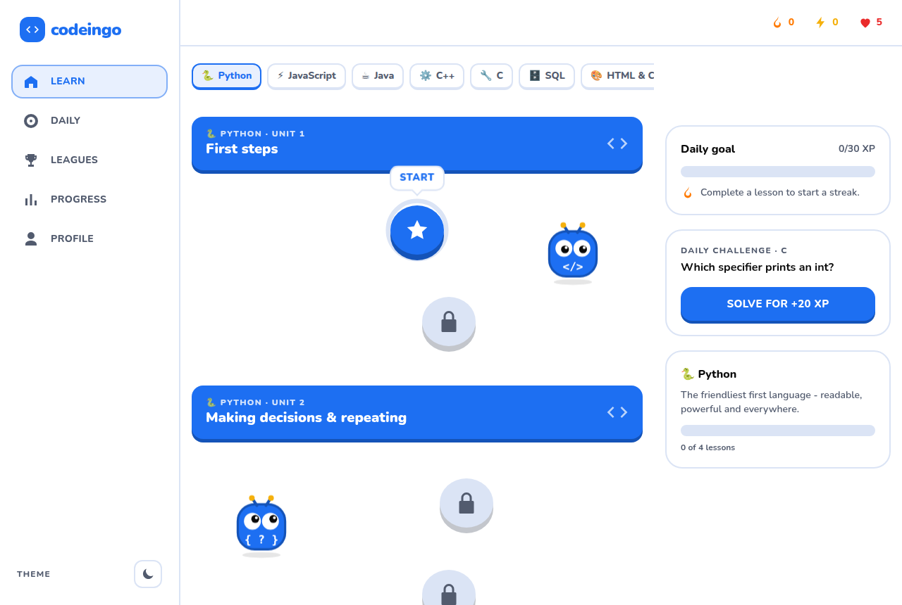
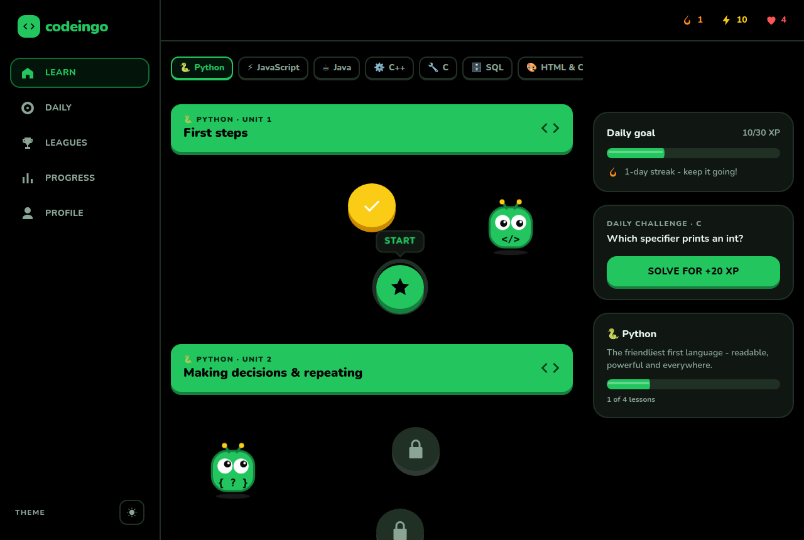
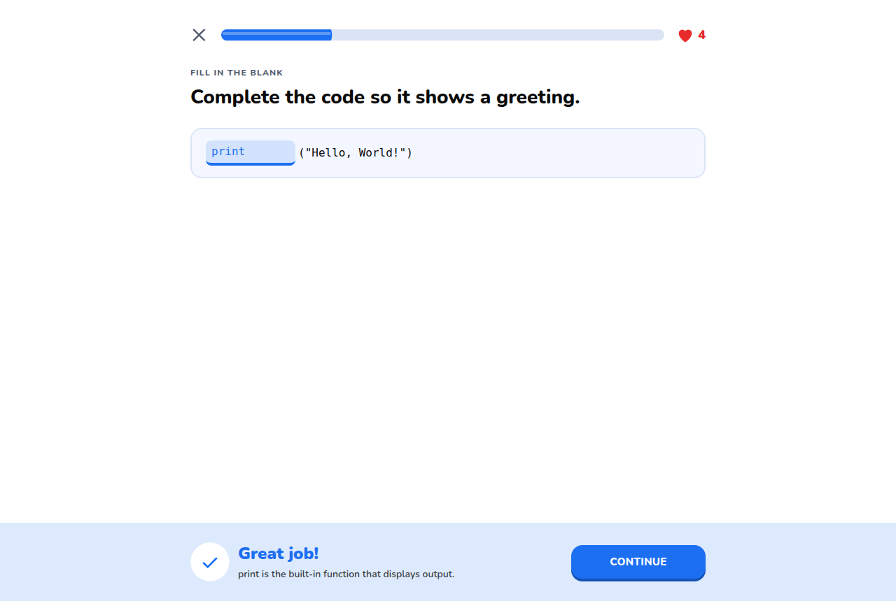
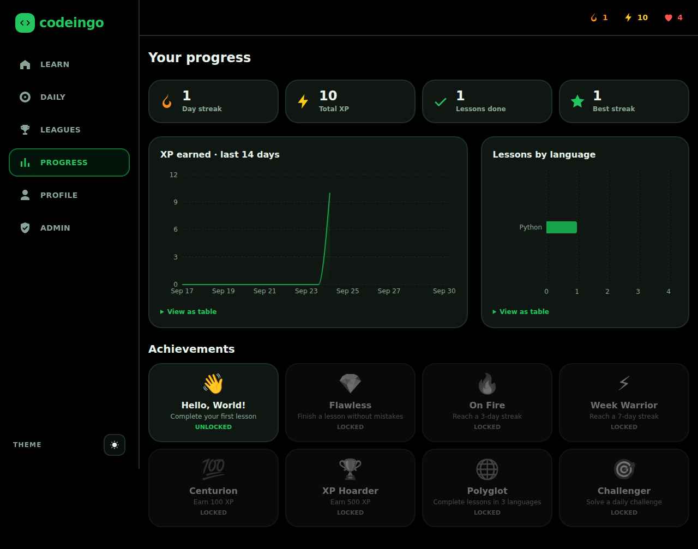
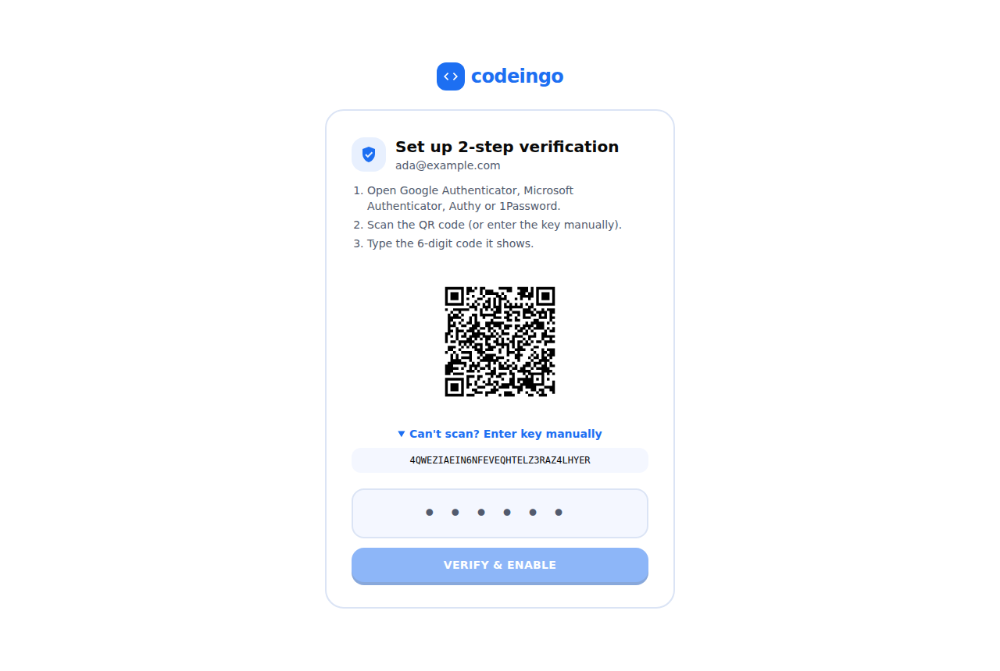
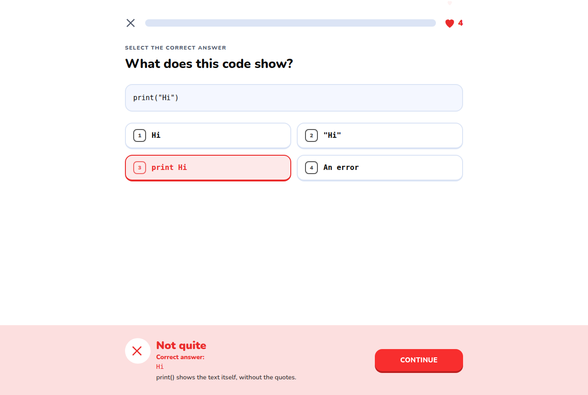
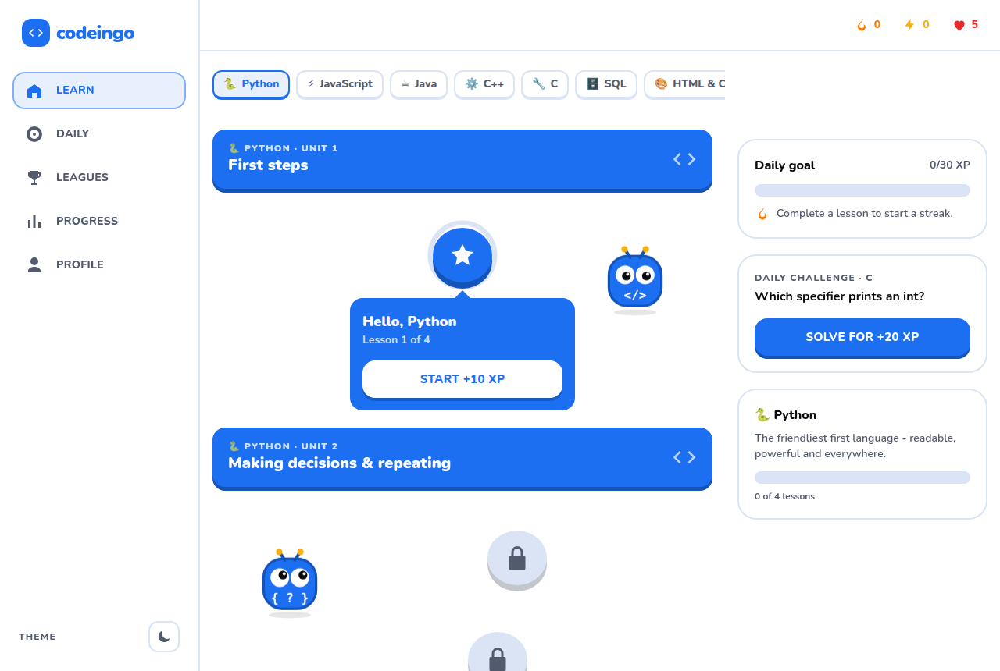
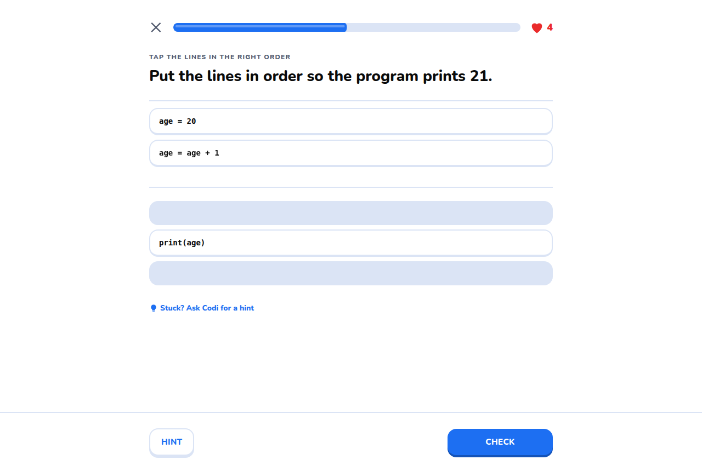
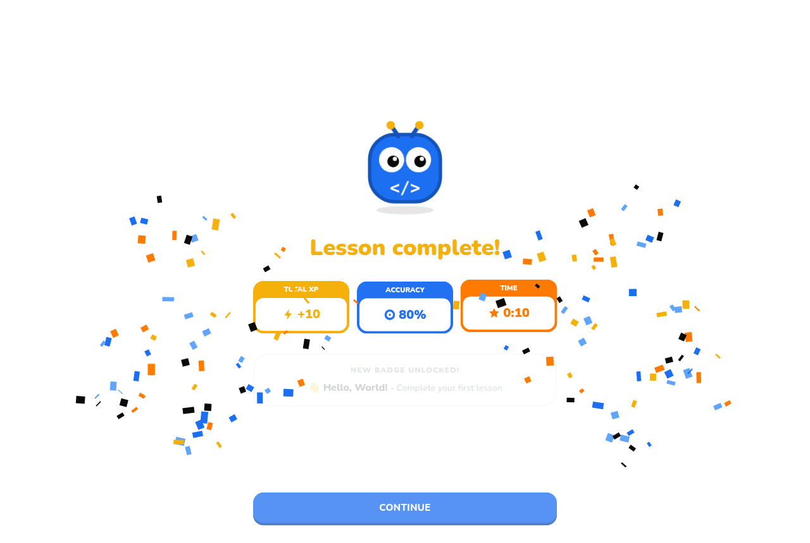
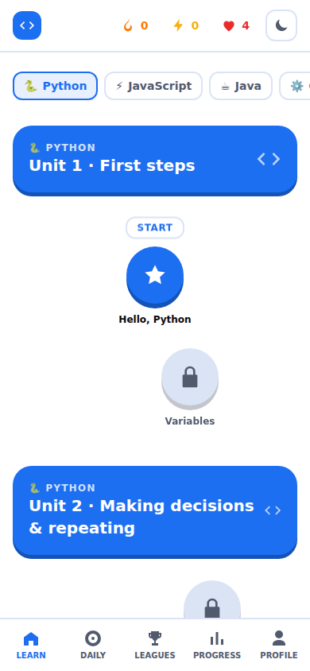

# Codeingo `</>`

**Duolingo, but for coding.** Codeingo is a gamified coding-learning platform: bite-sized lessons,
instant feedback, XP, streaks, hearts, badges, daily challenges, a weekly leaderboard and AI hints,
across **Python, JavaScript, Java, C++, C, SQL and HTML/CSS**.

Built to the Codeingo project specification (Chapters 1–3): **Next.js (App Router, React 19) + Tailwind + Recharts**
frontend, **FastAPI (Python) + PostgreSQL** backend, REST + JWT, optional LLM tutor
(OpenAI / Mistral / Llama 3 through any OpenAI-compatible API).

| Light - white · blue · black | Dark - black · green |
|---|---|
|  |  |
|  |  |
|  |  |
|  |  |
|  |  |

---

## Features

- **Sign in with Google (Gmail)** - OpenID Connect with PKCE, `state` and `nonce`; ID tokens verified against Google's keys.
- **Mandatory 2-step verification** for every account - TOTP (Google Authenticator, Authy, 1Password…), 10 single-use recovery codes.
- **Learning path** - courses → units → lessons, unlocked in order, winding Duolingo-style map.
- **4 exercise types** - multiple choice, fill-in-the-blank, arrange-the-code, write-the-code.
- **Gamification** - XP, daily goal, streaks, 5 hearts that refill over time, 8 badges, daily challenge, weekly league.
- **AI tutor "Codi"** - hints that nudge without giving away the answer (falls back to author hints if no AI is configured).
- **Progress dashboard** - XP over time and lessons per language (Recharts), achievements.
- **Admin panel** - edit lessons/exercises (validated server-side), enable/disable users, security audit log.
- **Responsive** - desktop sidebar, mobile bottom navigation; light/dark/system theme.
- **Duolingo-style feel at 60 fps** - springy 3D buttons, tap-to-open lesson popovers, sticky unit banners,
  word-bank tiles that fly into place, sliding exercise cards, slide-up feedback sheet, "N in a row" combos,
  heart-loss and XP count-up animations, confetti finish, sound effects & haptics (toggle in Profile).
  Every animation moves only `transform`/`opacity` (compositor-only) via [Motion](https://motion.dev), respects
  `prefers-reduced-motion`, and measured a steady 60 fps in a headless-Chromium frame-timing run.

## Security

See **[SECURITY.md](SECURITY.md)** for the full threat model. Highlights:

- Google sign-in + **required TOTP 2FA**, replay protection, lockout after 5 failures, hashed single-use recovery codes, TOTP secrets **encrypted at rest** (Fernet).
- Short-lived JWT access tokens (15 min) + **rotating refresh tokens with theft/reuse detection**; "log out of all devices" revokes everything instantly.
- Cookies are `HttpOnly`, `Secure`, `SameSite=Strict`; **CSRF** double-submit token + Origin check.
- **Rate limiting at two layers** (nginx `limit_req`/`limit_conn` + Redis-backed app limits), request-size caps, slowloris timeouts, bounded DB pool and statement timeouts → application-layer DDoS resistance. Put Cloudflare (or similar) in front for volumetric DDoS.
- Strict **Content-Security-Policy with a fresh nonce per request** (Next.js `proxy.js`), HSTS, `X-Frame-Options: DENY`, `nosniff`, COOP, Permissions-Policy.
- Answers are graded **server-side only** and never sent to the browser before answering; user code is **never executed** (pattern-matched with ReDoS-safe timeouts).
- ORM-only DB access (no SQL injection), strict Pydantic validation, no stack traces leaked, audit log of security events.
- Production **refuses to start** with weak secrets, dev login enabled, non-HTTPS URL, or SQLite.

## Project layout

```
backend/            FastAPI app
  app/security/     tokens, 2FA, CSRF, rate limiting, headers
  app/routers/      auth, learn, stats, ai, admin
  app/services/     Google OAuth, grading, gamification, AI tutor
  app/seed.py       starter curriculum (7 languages)
  tests/            pytest suite (security + learning flows)
frontend/           Next.js 16 app (App Router) + Tailwind + Recharts
  app/              routes: /, /2fa/*, /learn, /lesson/[id], /daily, /leaderboard, /stats, /profile, /admin
  proxy.js          per-request CSP nonce + security headers
  views/            page components   components/  shared UI   lib/  API client, auth, theme
deploy/             nginx (edge limits, headers), Caddy (automatic HTTPS)
docker-compose.yml  caddy -> nginx -> Next.js / FastAPI -> postgres/redis
```

## Run locally (development)

Requirements: Python 3.11+, Node 20.19+.

```bash
# 1. API
cd backend
python -m venv .venv && source .venv/bin/activate
pip install -r requirements-dev.txt
cat > .env <<'EOF'
ENV=development
DEV_LOGIN_ENABLED=true            # password-less dev login (still requires 2FA). Never in production.
ADMIN_EMAILS=["you@example.com"]
PUBLIC_URL=http://localhost:3000
# Optional: real Google sign-in locally
# GOOGLE_CLIENT_ID=...
# GOOGLE_CLIENT_SECRET=...
# GOOGLE_REDIRECT_URI=http://localhost:3000/api/auth/google/callback
EOF
uvicorn app.main:app --reload --port 8000

# 2. Web (new terminal)
cd frontend
npm install
npm run dev          # http://localhost:3000  (Next rewrites /api to :8000)
```

Open http://localhost:3000, use **Developer login**, scan the QR code with an authenticator app and start learning.

Run the tests:

```bash
cd backend && pytest -q
```

## Deploy (production)

1. **Google OAuth client** - Google Cloud Console → *APIs & Services → Credentials → Create OAuth client ID → Web application*.
   Authorized redirect URI: `https://YOUR_DOMAIN/api/auth/google/callback`. Configure the OAuth consent screen (scopes: `openid email profile`).
2. **Configure** - `cp .env.example .env` and fill in every value (the file explains how to generate each secret).
3. **DNS** - point `DOMAIN` at your server; open ports 80/443.
4. **Start** - `docker compose up -d --build`. Caddy obtains an HTTPS certificate automatically.
5. **DDoS** - put the domain behind Cloudflare (proxied, "Under Attack" mode available) or another CDN/WAF for network-level floods.

Only Caddy publishes ports; nginx, the API, PostgreSQL and Redis sit on private networks, and the containers run read-only, as non-root, with all Linux capabilities dropped.

## Adding content

Sign in with an email listed in `ADMIN_EMAILS` → **Admin → Content**. Lessons are JSON:

| kind | public `data` | private `solution` |
|---|---|---|
| `mcq` | `{"options": [...]}` | `{"index": 0}` |
| `fill` | - (use `___` in `code`) | `{"accepted": ["print"]}` |
| `order` | `{"lines": [... in correct order ...]}` | `{}` (lines are shuffled when served) |
| `code` | `{"starter": ""}` | `{"patterns": ["regex", ...], "forbid": [], "example": "..."}` |

## Roadmap (from the specification)

Interview-prep tracks, collaborative coding & real-time contests (WebSockets), sandboxed code execution
(e.g. isolated Judge0/Piston workers), personalised recommendations (scikit-learn / PyTorch), WebAuthn passkeys.
